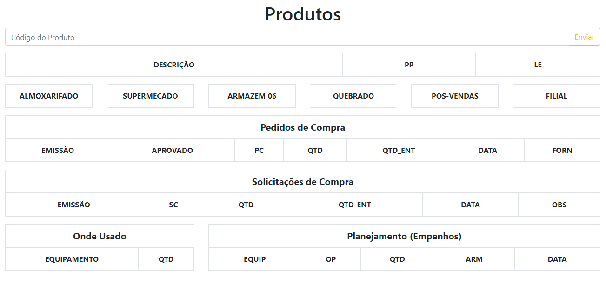

<h1 align="center">
  
</h1>

<h3 align="center" >
  An API in Node, powered by SQL protheus database, and a React application to show the data.
</h3>

<p align="center">

  <a href="https://github.com/ArthurPedroti" target="_blank">
    
  </a>
  <a href="https://github.com/ArthurPedroti" target="_blank" >
    
  </a>
  <a href="https://www.linkedin.com/in/arthurpedroti/" target="_blank" >
    
  </a>
  <a href="mailto:arthurpedroti@gmail.com" target="_blank" >
    
  </a>
  <a href="https://api.whatsapp.com/send?phone=5519991830454"
        target="_blank" >
    
  </a>

</p>

# Script for update the app on Server

1º - Login with SSH<br/>
2º - cd Protheus-API<br/>
3º - git pull<br/>
4º - cd frontend<br/>
5º - `npm run build` or `sudo yarn build`<br/>
6º - pm2 restart all<br/>

# Server Setup

<h3>1º - Install Node</h3></br>

```
curl -sL https://deb.nodesource.com/setup_8.x -o nodesource_setup.sh
```
```
sudo bash nodesource_setup.sh
```
```
sudo apt install nodejs
```
```
sudo apt install build-essential
```

<h3>2º - Install PM2</h3>

```
sudo npm install pm2@latest -g
```

<h3>3º - Setting PM2 on Start Up</h3>

``
pm2 startup systemd
``

When you start the services, you can save the list for restart with:</br>
`
pm2 save
`
</br>

<h3>4º - Install Yarn</h3></br>
```
curl -sS https://dl.yarnpkg.com/debian/pubkey.gpg | sudo apt-key add -
```
```
echo "deb https://dl.yarnpkg.com/debian/ stable main" | sudo tee /etc/apt/sources.list.d/yarn.list
```
`sudo apt update`<br>
`sudo apt install --no-install-recommends yarn`<br>

## Author

👤 **Arthur Pedroti**

* Github: [@ArthurPedroti](https://github.com/ArthurPedroti)
* Linkedin: [@ArthurPedroti](https://www.linkedin.com/in/arthurpedroti)

## Contributing

Contributions, issues and feature requests are welcome!

## Show your support

Give a ⭐️ if this project helped you!

## License

Copyright © 2020 [Arthur Pedroti](https://github.com/ArthurPedroti).<br />
This project is [MIT](https://github.com/ArthurPedroit/pv-agf-frontend/blob/master/LICENSE) licensed.

---

Made by :blue_heart: by [Arthur Pedroti](https://github.com/ArthurPedroti)
